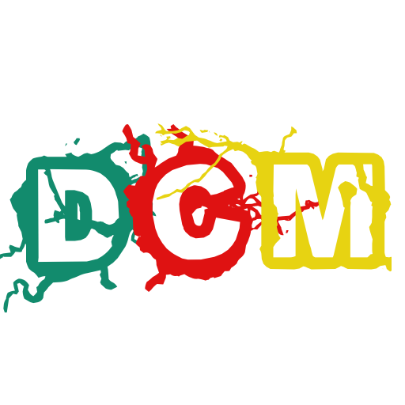
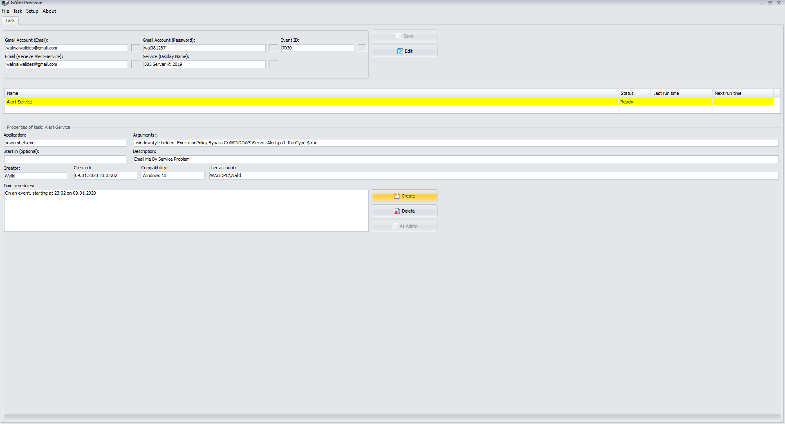

# DCM ( Delphi Code Manager )
DCM extends the Delphi/C++Builder IDE by adding some new productivity features.

**Authors:**  *WalWalWalides*
------

`DCM` help programmer to get quickly information and help by searching for Source Code.

Principal Software Benefits:

     - Get instance information by searching for Source Code
     
     - Create a bank sorting code

### Main View

------

## Features:

    - Management code source
	
    - Show project for active file in Project Manager
	
    - Editor tab double click action
	
    - Loading Module

	
------	

------

## Contains

| File | Contents | 
| --- | --- |
| .gitignore | Git ignores the Files in this File |
|[DCM_Install__Setup](https://github.com/walwalwalides/DCM/releases/download/DCM/DCM__Setup.exe)| Download GAlertService.
| README.md | The Readme for this Project|

------

## Installation

    - Download the installation files
	
    - Press the Install button.

# If You Want To Donate!

