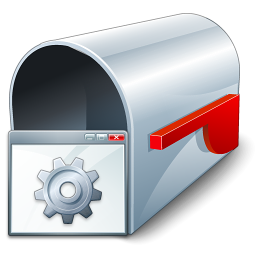

# DCM ( Delphi Code Manager )
DCM is a Software Solution for Creating a Windows Service Monitor Using Email.

**Authors:**  *WalWalWalides*
------

`GAlertService` help programmer to get quickly information by windows service Error.

Principal Software Benefits:

     - Get instance information by windows service Error
     
     - Use your own Gmail account to receive information

### Main View

------

## To Create a Monotoring Alert:

The two most important steps to do: 

- First,you need to define a "Event ID" ,the Event ID should be between 7000 and 7044 ,it's below to (Service Control Manager Eventlog).

For more Information you can find Here : 
https://www.geoffchappell.com/studies/windows/win32/services/scm/events/eventlog.htm

- Second, by using Gmail account ,you have to deactivate more security (Option) in Gmail account to send and recieve emails without any problem.
that means "Allow less secure app" an (On) State.

------

## Contains

| File | Contents | 
| --- | --- |
| .gitignore | Git ignores the Files in this File |
|[GAlertService.exe](https://github.com/walwalwalides/GAlertService/releases/download/GAlertService/GAlertService__Setup.exe)| Download GAlertService.
| README.md | The Readme for this Project|

------

# If You Want To Donate!

